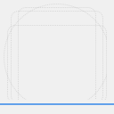

<!-- FIXME Uncomment once published at Flathub -->
<!-- <a href="https://flathub.org/apps/details/com.mateusf.sockety"> -->
<!--  -->
<!-- </a> -->

# Sockety

A native GNOME client for testing Socket.IO servers: connect, emit events and
inspect what comes back, without a browser-based tool.

## Hack on Sockety

To build the development version of Sockety and hack on the code
see the [general guide](https://developer.gnome.org/documentation/tutorials/beginners/getting_started.html)
for building GNOME apps with Flatpak and GNOME Builder.

<!-- FIXME Uncomment once available at Damned Lies -->
<!-- ## Translations -->

<!-- Helping to translate Sockety or add support to a new language is very -->
<!-- welcome. You can find everything you need at: -->
<!-- [l10n.gnome.org/module/sockety/](https://l10n.gnome.org/module/sockety/) -->

## Code Of Conduct

This project follows the [GNOME Code of Conduct](https://conduct.gnome.org/).
